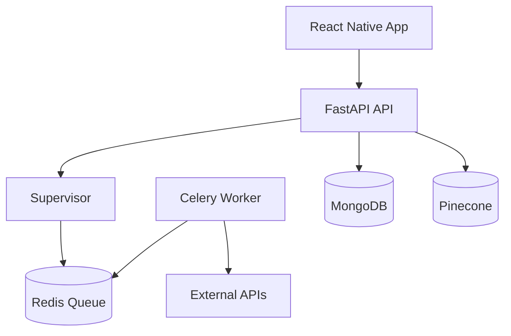
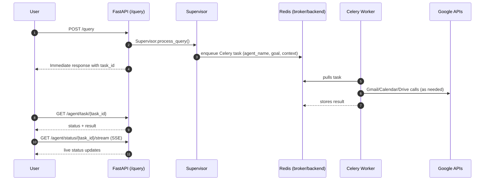
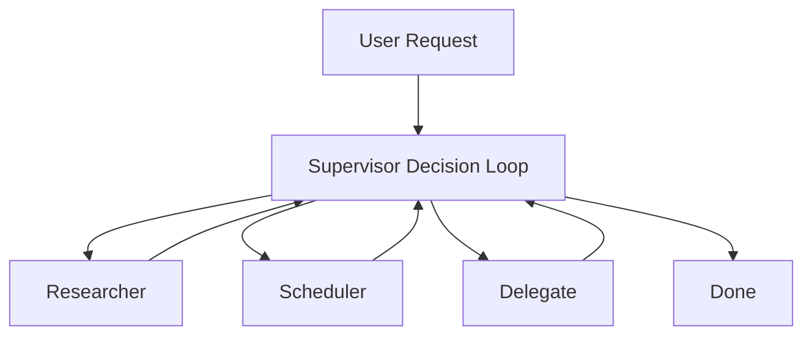

# ALFRED - Agentic Layer for Frameworked Reasoning, Execution & Delegation

## ⚠️ Disclaimer

This is a public documentation repository.

The implementation code is private, as the system runs against my personal data and id rather not have it stolen.
This repo exists to document design and system architecture.
If you’re interested in a walkthrough or live demo, feel free to reach out to me.

This repository contains documentation on **ALFRED**, an **agentic personal assistant** built around a **Supervisor agent** that can:

- Answer natural-language queries
- Use tools (email, calendar, web search, docs) when needed
- Delegate **long-running work** to background workers (Celery + Redis)
- Persist and recall key information via **MongoDB memory**
- Provide **Tasks** + **Notifications** APIs and **SSE streams** for real-time updates

The backend is a **FastAPI** service; the mobile client lives in `app/` (React Native).

---

## What this system does (high level)

- **`/query`**: You send a user request. The **Supervisor** decides whether to:
  - Handle it inline (quick reads/writes via MCP email/calendar tools), or
  - **Delegate** it to a specialized autonomous agent (e.g., Inbox Agent) as a **Celery task**
- **Background tasks**: You get an immediate response with a `task_id`, then monitor progress/results via:
  - **`/tasks`** (list tasks)
  - **`/agent/task/{task_id}`** (status/result)
  - **`/agent/status/{task_id}/stream`** (SSE stream for task updates)
  - **`/notifications`** (includes “task complete/failed” notifications)
  - **`/notifications/stream`** (SSE stream for notification events)

---

## Architecture

- The app talks to the API via **REST** and listens via **SSE** for real-time updates.
- The Supervisor can enqueue long-running work via **Redis**, processed by the **Celery Worker**.
- “External APIs” includes **LLM providers** + **Google APIs** (Gmail/Calendar/Drive/OAuth).
- The API persists state to **MongoDB** and uses **Pinecone** for RAG.

### Delegated task lifecycle (sequence)

---

## Key components

- **Supervisor Agent** (`Assistant/agents/supervisor.py`)

  - Orchestrates email/calendar workflows via **MCP stdio servers** (`Assistant/mcp_servers/*`)
  - Chooses: **RESEARCHER**, **SCHEDULER**, **DELEGATE_TO_AGENT**, or **DONE**
  - Delegation is used for **domain-specific + complex/long-running** tasks

### Supervisor architecture (personality swapping)

The Supervisor runs a **decision loop**. On each iteration it evaluates the current state (user request + workflow history + task context) and selects the next “personality”:

- **Researcher**: read-only information gathering (email/calendar reads)
- **Scheduler**: write-only execution (create events, save drafts, send emails only when explicitly requested)
- **Delegate**: offload a domain-specific long-running task to an autonomous agent via Celery
- **Done**: return a final answer or status update

- **Researcher**: gathers info (email/calendar reads) and returns findings to the decision loop.
- **Scheduler**: executes actions (create events, save drafts; sends only when explicitly asked) and returns results.
- **Delegate**: offloads to an autonomous domain agent; returns a `task_id` and later status/result back into the loop.
- **Done**: returns the final response (or a status update if a task is still running).

- **Specialized agents**

  - **Inbox Agent** (`Assistant/agents/inbox_agent.py`): email operations + web search + long inbox analysis
  - **Calendar Agent** (`Assistant/agents/calendar_agent.py`): calendar reads/writes and scheduling logic

- **Async execution (Celery + Redis)**

  - `Assistant/worker.py` defines `run_agent_task` (Celery task) which runs async agents inside a dedicated event loop.
  - Redis is used as **broker** and **result backend** (see `CELERY_BROKER_URL`, `CELERY_RESULT_BACKEND`).

- **Memory (MongoDB)**

  - `Assistant/database/memory.py` stores:
    - **Long-term memory** (persistent facts / profile / relationships)
    - **Short-term memory** (expiring, includes delegated tasks tracking under `delegated_tasks`)

- **RAG (Pinecone)**

  - The backend includes document ingestion endpoints and a vector-store integration for retrieval.

- **Tasks + Notifications**
  - `/tasks` lists delegated tasks stored in short-term memory and cross-references Celery state.
  - `/notifications` includes reminders + **task complete/failed** notifications + draft count (cached).
  - Both have **SSE** streaming endpoints for real-time UI updates.

---

## External APIs used

This project integrates with:

- **OpenAI API**

  - Chat completions via `langchain-openai`
  - Embeddings (configured as `text-embedding-3-small` in `Assistant/utils/config.py`)

- **Pinecone**

  - Vector store for RAG

- **Google APIs**

  - **Gmail API** (read/search/view, drafts, send)
  - **Google Calendar API** (events and scheduling)
  - **Google Drive API** (document ingest/links)
  - OAuth endpoints (e.g., `oauth2.googleapis.com` during token refresh/auth)

- **Redis**

  - Celery broker + result backend

- **MongoDB**
  - Long/short-term memory persistence

---

## Mobile app (React Native)

The app in `app/` provides:

- **Chat UI** for `/query`
- **Tasks page** to monitor background work (`/tasks`, task SSE stream)
- **Notifications page** (+ an auto-fetch toggle to reduce API polling)
