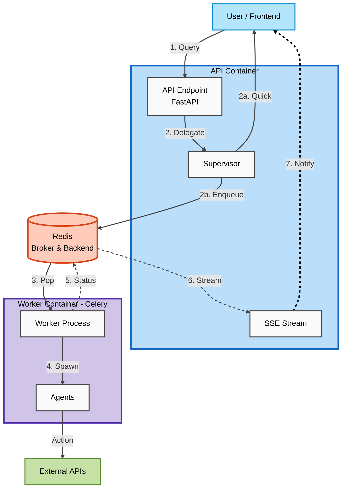
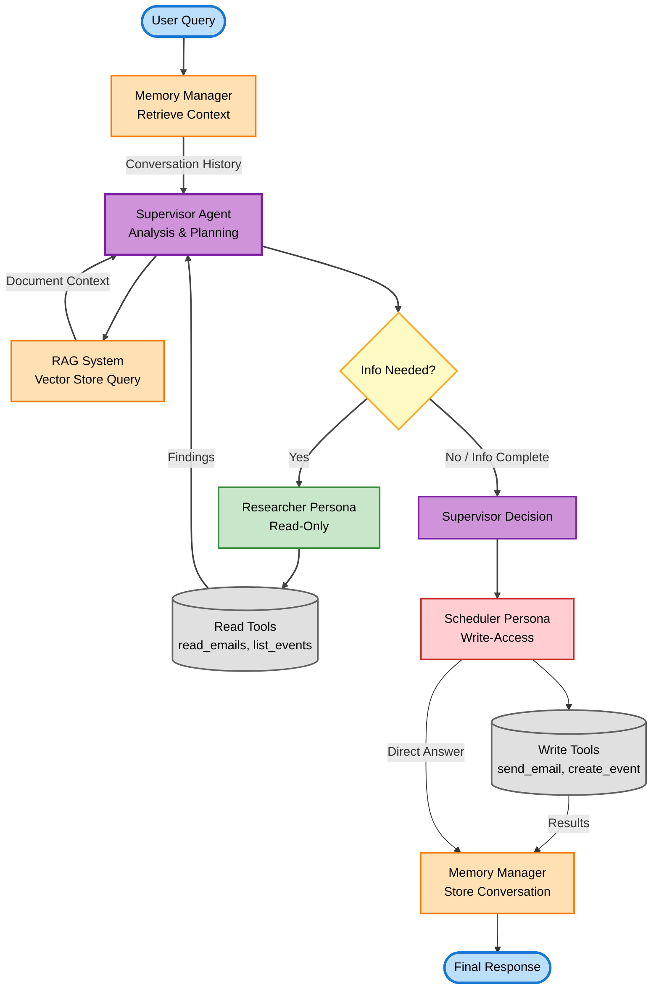

# Agentic Personal Assistant

## ⚠️ Disclaimer

This is a **public documentation repository**.

- The **implementation code is private**, as the system runs against my personal data and id rather not have it stolen.
- This repo exists to document **design and system architecture**.
- If you’re interested in a **walkthrough or live demo**, feel free to reach out to me.

---

## Overview

The Agentic Personal Assistant (APRIL) is an multi agentic system I designed to use my personal data (documents, emails, calendar) to make my life easier.

---

## 🏗️ High-Level Architecture

At a high level, the system is structured as a distributed backend service with clear separation between:

- **API Container (FastAPI)**: Handles request validation, routing, and real-time status streaming via SSE
  - **FastAPI**: Python web framework providing REST API endpoints for query processing
  - **SSE Stream (Server-Sent Events)**: Real-time status updates for long-running tasks via `/agent/status/{task_id}/stream` endpoint
- **Supervisor Agent**: Orchestrates tasks using Model Context Protocol (MCP) servers
  - **MCP (Model Context Protocol)**: Protocol-based tool access system connecting to Email and Calendar MCP servers
- **Infrastructure (Redis)**: Task queue broker and result backend for asynchronous processing
  - **Redis Broker**: Message queue for distributing tasks to workers
  - **Redis Backend**: Stores task results and status information
- **Worker Container (Celery)**: Independent worker processes for long-running tasks
  - **Celery**: Distributed task queue system executing agent tasks asynchronously
- **Specialized Agents**: Domain-specific agents for different capabilities
  - **Inbox Agent**: Manages Gmail operations (read, send, search emails)
  - **Calendar Agent**: Manages Google Calendar operations (list, create, update, delete events)
  - **Suggestor Agent**: Classifies queries and routes to appropriate agents
- **External APIs**: Gmail API, Google Calendar API, and OpenAI LLM services (gpt-4o-mini)

Design goals:

- **Independent Lifespans**: Worker processes run independently of the API, surviving restarts
- **Observability**: SSE streams provide real-time status updates for long-running tasks
- **Scalability**: Multiple worker instances can process tasks in parallel from the shared Redis queue
- **Reliability**: Task persistence in Redis ensures jobs aren't lost on failures

---

## ⚙️ Agent Execution Model

Each request flows through a constrained execution pipeline:

1. **Context Retrieval**

   - **Memory Manager**: Retrieves conversation history (short-term context) from MongoDB
   - **RAG System**: Queries vector store (Pinecone) for relevant documents (long-term knowledge)

2. **Supervisor Analysis & Planning**

   - Supervisor Agent analyzes the query with full context
   - Connects to Email and Calendar MCP servers
   - Creates execution plan and determines if additional information is needed

3. **Information Gathering (Researcher Persona)**

   - Researcher Persona (read-only) gathers information via MCP servers
   - **Email MCP Tools**: `read_emails`, `count_emails`, `get_email_details` for searching and reading Gmail messages
   - **Calendar MCP Tools**: `list_events`, `get_day_schedule` for viewing Google Calendar availability
   - Findings are returned to Supervisor for decision-making

4. **Decision & Execution (Scheduler Persona)**

   - Supervisor makes final decision based on gathered information
   - Scheduler Persona (write-access) executes actions via MCP servers
   - **Email MCP Tools**: `send_email` for sending Gmail messages
   - **Calendar MCP Tools**: `create_event` for booking Google Calendar events
   - Results are returned and stored in memory

5. **Memory Storage & Response**
   - Conversation is stored in Memory Manager for future reference
   - Final response is returned to the user

The system uses a **role-based safety model** where read operations are separated from write operations, prioritizing **predictability and debuggability** over maximal autonomy.

**Available Agents:**

- **Supervisor Agent**: Orchestrates workflows using MCP servers (Email and Calendar)
- **Inbox Agent**: Manages Gmail operations (read, send, search emails) and web searches
- **Calendar Agent**: Manages Google Calendar operations (list, create, update, delete events) and web searches
- **Suggestor Agent**: Classifies queries and routes to appropriate agents

**MCP Server Tools:**

- **Email MCP Server**: `read_emails`, `send_email`, `count_emails`, `get_email_details`
- **Calendar MCP Server**: `list_events`, `create_event`, `get_day_schedule`

---

<!--
## 🧩 Memory Model

> **Diagram placeholder:** `diagrams/memory-lifecycle.png`

<!--
INSERT IMAGE HERE
-->

The assistant uses **explicit memory separation**:

### Short-Term Memory

- Exists only for the duration of a request or task
- Stores intermediate reasoning and tool outputs
- Never persisted

### Long-Term Memory

- Stores durable information (documents, user-provided context)
- Backed by a vector store for retrieval
- Write access is intentionally constrained

Key principles:

- Not everything should be remembered
- Memory writes are explicit, not automatic
- Retrieval quality matters more than recall volume
  -->

---

## 🔎 Retrieval-Augmented Generation (RAG)

The system uses a retrieval pipeline to query personal documents and structured data.

Characteristics:

- Explicit chunking and embedding strategy
- Retrieval scoped to task-relevant context
- Iterated on after observing hallucinations and irrelevant context under real usage

RAG is treated as a **retrieval system**, not just a prompt enhancement.

---

## 📊 Observability & Debugging

The system is instrumented to support live operation and iteration:

- Structured logs for agent decisions and tool calls
- Execution traces for multi-step tasks
- Latency metrics to identify bottlenecks
- Visibility into failure modes instead of silent degradation

Observability exists because **agent systems fail in non-obvious ways**.

---

## ⚠️ Failure Modes & Tradeoffs

This project explicitly documents known limitations:

- Early designs overused autonomous agent chaining, leading to unpredictable behavior and difficult debugging.
- Naive similarity-based retrieval surfaced irrelevant context for long-tail queries.
- Stateless designs failed for multi-turn tasks and were refactored.

Current tradeoffs:

- Reduced autonomy → increased reliability
- Explicit control → easier debugging
- Simpler execution paths → predictable behavior

These choices are intentional.

---

## 🚀 Deployment & Operation

- Operated as a long-running, containerized backend service
- Schema changes and memory resets handled explicitly
- Backward-incompatible changes required migration or cleanup

This system is maintained as something that must **keep working**, not a one-off experiment.

---

## 🎥 Demo

> **Demo video placeholder:** (link coming soon)

<!--
INSERT DEMO VIDEO LINK HERE
-->

The demo will include:

- Live agent execution
- Retrieval traces
- Observability during a real task
- Discussion of constraints and failure handling

If you’re interested in a walkthrough before the video is available, feel free to reach out.

---

## 🔧 Status

This is an actively evolving personal system.
Current focus areas:

- Improving retrieval quality
- Tightening execution guardrails
- Making failures easier to reason about
